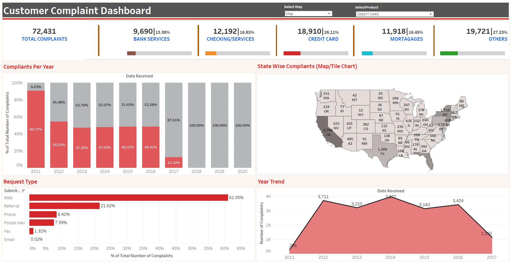

# 🏦 Customer Complaint Dashboard (Tableau Project)

This repository contains a **Tableau Dashboard** that provides an in-depth analysis of **customer complaints** across multiple financial products such as **Credit Card, Loans, Mortgages, Savings Accounts, and more**.  
It highlights complaint trends, submission methods, and geographic distribution to uncover key insights and improve customer service strategies.  

---

## 📖 Project Overview  

The Customer Complaint Dashboard was designed to answer questions such as:  

- Which product receives the highest number of complaints?  
- Which states have the highest complaint volume?  
- What are the most common submission methods?  
- How have complaints changed over the years?  

The dashboard uses **interactive filters and parameters** to explore trends and compare performance across multiple categories.  

---

## ✨ Key Insights  

📊 **Product-Wise Breakdown** – Credit Card and Mortgages together account for the highest share of complaints.  
🗺 **Geographic Distribution** – California, Texas, and New York lead in complaint counts.  
📆 **Yearly Trends** – Peak complaint volumes observed between 2013–2016 with a declining trend post-2017.  
🖥 **Submission Method** – More than 60% of complaints are submitted via the Web, followed by Referrals.  
🎛 **Dynamic Parameter** – Select product type from **Credit Card, Loans, Mortgages, Savings Accounts, Others** to update the entire dashboard dynamically.  

---

## 📷 Dashboard Preview  

---

## 🌐 Live Dashboard  

👉 [Click here to view the interactive dashboard on Tableau Public](https://public.tableau.com/app/profile/shanmukha.sai.bada/viz/CustomerCompliantsDashboard/CustomerComplaintDashboard)  

---

## 🛠️ Tools & Technologies Used  

- **Tableau Public** – For dashboard creation & visualization  
- **Excel/CSV** – For data storage, cleaning, and preparation  
- **GitHub** – For project hosting & documentation  
- **Markdown** – For README creation with images and links  

---

## 📊 Data & Methodology  

### 📥 Data Collection  
- Complaint data including **product type, date received, submission method, and state information**.  

### 🧹 Data Cleaning & Preparation  
- Removed duplicates and standardized product names.  
- Extracted **year** from `Date Received` column for year-wise analysis.  
- Created calculated fields for **% of Total Complaints** and **KPIs**.  

### 📈 Dashboard Creation in Tableau  
- Built **KPI Cards** for Total Complaints and Product-Wise Counts.  
- Created **Stacked Bar Charts** for yearly trends.  
- Added a **Map Visualization** for state-wise complaints.  
- Built a **Parameter Control** to dynamically switch product categories.  
- Designed a clean and minimal layout for better readability.  

### 🔎 Insights Generation  
- Identified **top complaint products & states**.  
- Analyzed **submission methods** and their contribution.  
- Compared year-over-year complaint trends to highlight improvements.  

---

## 👤 Author  

**Shanmukha Sai Bada**  
📧 [badashanmukhasai@gmail.com](mailto:badashanmukhasai@gmail.com) | 🌐 [LinkedIn](https://www.linkedin.com/in/shanmukha-sai-bada/)  

---
